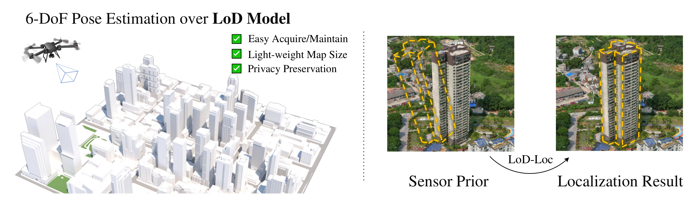

<p align="center">
  <h1 align="center"><ins>LoD-Loc</ins>:<br>Visual Localization using LoD 3D Map with Neural Wireframe Alignment</h1>
  <p align="center">
    <h>Juelin&nbsp;Zhu</h>
    ·
    <h>Shen&nbsp;Yan</h>
    ·
    <h>Long&nbsp;Wang</h>
    ·
    <h>Shengyue&nbsp;Zhang</h>
    ·
    <h>Yu&nbsp;Liu</h>
    ·
    <h>Maojun&nbsp; Zhang</h>
  </p>
  <h2 align="center">NeurIPS 2024</h2>

  <h3 align="center">
    <a href="https://victorzoo.github.io/LoD-Loc.github.io/">Project Page</a>
    | <a href="https://xxxx">Paper(coming soon)</a> 
    | <a href="./demo.ipynb">Demo</a>
  </h3>
  <div align="center"></div>
</p>
<p align="center">
    <a href="assets/intro.png"></a>
    <br>
    <em>LoD-Loc tackles visual localization w.r.t a scene represented as LoD 3D map. Given a query image and its pose prior, the method utilizes the wireframe of LoD models to recover the camera pose.</em>
</p>

This repository is an implementation of the paper "LoD-Loc: Visual Localization using LoD 3D Map with Neural Wireframe Alignment", a research project by Virtual Reality and Computer Vision Lab, National University of Defense Thechnology. LoD-Loc, a novel approach tailored for visual localization in LoD 3D city maps, takes a query image with its sensor priors (i.e., GPS, gravity and compass) as input, and estimates the 6-DoF pose of a drone in flight. The core idea is that if the pose is solved correctly, the network-predicted building wireframes can align with those projected from the LoD 3D model.


## Installation

LoD-Loc requires Python >= 3.8 and [PyTorch](https://pytorch.org/).  To run the evaluation and training, install the full requirements:

```bash
git clone https://github.com/VictorZoo/LoD-Loc

cd LoD-Loc
python -m pip install -r requirements/full.txt
```

The project is equipped with Pytorch==2.0.1 and Pytorch-Lightning==2.1.3.

## Demo
1. [DEMO-LoD Projection](https://youtu.be/6pRLOanBM78) shows the localization results of several drone-captured videos, including RGB and Thermal modal.
[](https://youtu.be/6pRLOanBM78 "LoD-Loc: DEMO-LoD Projection")

2. [DEMO-Wireframe Projection](https://youtu.be/KbNunrknDiA) shows the localization results of several drone-captured videos, including RGB and Thermal modal.
[](https://youtu.be/KbNunrknDiA "LoD-Loc: DEMO-Wireframe Projection")

3. Try a Jupyter Demo - take one picture and find its exact pose in a few seconds!
- Local demo with Jupyter notebook [`demo.ipynb`](./demo.ipynb)

## Dataset Preprocessing

### Downloading

The datasets could be found in [Baidu Disk link](https://pan.baidu.com/s/1v3GCkjJiyrD-z72fWB_D2g?pwd=vx2a)(Extract Code:vx2a). The data should be placed in `./dataset/${data_name}$` directory and the arrangement is shown as:

<details>
<summary>[Dataset Arrangement]</summary>

```
** under the root data folder ./dataset **
UAVD4L-LoD
  ├──inTraj
  │   ├──Query_image
  │   │   ├──DJI_20231207152043_0001_W.JPG
  │   │   └──...
  │   ├──GPS_pose.txt
  │   ├──GT_pose.txt
  │   └──intrinsic.txt
  ├──outTraj
  │   ├──Query_image
  │   │   ├──DJI_20231018092903_0016_D.JPG
  │   │   ├──...
  │   ├──GPS_pose.txt
  │   ├──GT_pose.txt
  │   └──intrinsic.txt
  ├──Synthesis
  │   ├──Query_image
  │   │   ├──400242@3131119@150@44@-65@0.jpg
  │   │   └──...
  │   ├──GPS_pose.txt
  │   ├──GT_pose.txt
  │   └──intrinsic.txt
  ├──split
  │   ├──UAV_inTraj_test.json
  │   ├──UAV_outTraj_test.json
  └───└──UAV_train.json

Swiss-EPFL
  ├──outPlace
  │   ├──Query_image
  │   │   ├──urbanscape-2020-09-17-piloted_00000_DJI_0029_img.jpg
  │   │   └──...
  │   ├──GPS_pose.txt
  │   ├──GT_pose.txt
  │   └──intrinsic.txt
  ├──inPlace
  │   ├──Query_image
  │   │   ├──urbanscape-2020-09-17-piloted_00000_DJI_0029_img.jpg
  │   │   └──...
  │   ├──GPS_pose.txt
  │   ├──GT_pose.txt
  │   └──intrinsic.txt
  ├──Synthesis
  │   ├──Query_image
  │   │   ├──urbanscape-LHS_00000_img.png
  │   │   └──...
  │   ├──GPS_pose.txt
  │   ├──GT_pose.txt
  │   └──intrinsic.txt
  ├──split
  │   ├──Swiss_inPlace_test.json
  │   ├──Swiss_outPlace_test.json
  └───└──Swiss_train.json

MODEL
  ├──UAVD4L-LoD.obj
  ├──UAVD4L-LoD.blend
  ├──Swiss-EPFL-LoD.obj
  └──Swiss-EPFL-LoD.blend
```

</details>


* [Optional] We also provide the process of extracting or generating priors for a reference:

```bash
# Extract the sensor priors from UAVD4L-LoD dataset
python ./script/Read_EXIF.py --input_EXIF_photo ${Query_image_dir}$ --txt_pose ${prior_pose.txt}$

# Generate the sensor priors from Swiss-EPFL dataset
python ./script/Generate_priors.py --GT_folder ${GT_pose_dir}$ --save_folder ${prior_pose.txt}$
```

* NOTE 1: The above step "extracting or generating priors" is optional. All data can be downloaded from the given website.

* NOTE 2: In order to protect privacy, the center point of the model in UAVD4L-LoD dataset is hidden. Please use the Sensor Priors downloaded from the web disk directly.

* NOTE 3: The UAV query data of Swiss-EPFL has been set up by [CrossLoc](https://github.com/TOPO-EPFL/CrossLoc-Benchmark-Datasets) project, and please refer to the project for more details or original data.

* NOTE 4: The Swiss-EPFL LoD model is processed, and the processing code can be found at `./script/trans_obj_coor.py`. For raw LoD data, please find [Swisstopo](https://www.swisstopo.admin.ch/en/landscape-model-swissbuildings3d-3-0-beta) website to download.


### Preprocessing

To get dataset for a specific scene, run the following:

```bash
python ./script/data_proccess.py  --config_file=./config/UAV_preprocess.json
```

The details of `./config/*.json` file:

```
"data_name"           # the dataset name
"scene_name"          # the sence name of dataset
"model_pth"           # the directory of .obj and .blend files
"blender_pth"         # the local executable program of BLENDER
"interval"            # sampling interval list for wireframe points
"if_save"             # whether visulize the projected wireframe images or not;
```


In addition to generating data one by one, you can also use the following bash files to execute for getting full data：

```
bash ./bash_script/data_process.sh
```

NOTE: the *blender_pth* should be changed according to your local BLENDER application address.


## Training


We trained models on the UAVD4L-LoD and Swiss-EPFL dataset separately using 2x 4090 GPUs (24GB VRAM each) and a total batch size of 16 for 65 epoch (about 14 hours) with the following command:

```bash
python -m maploc.train data=UAVD4L-LoD experiment.name=${exp_dir}$
```

Feel free to use any other experiment name. Configurations are managed by [Hydra](https://hydra.cc/) and [OmegaConf](https://omegaconf.readthedocs.io) so any entry can be overridden from the command line. You may thus reduce the number of GPUs and the batch size via:

```bash
python -m maploc.train experiment.name=${ckpt_dir}$ \
  experiment.gpus=1 data.loading.train.batch_size=12
```

The checkpoints are written to `./experiments/${exp_dir}$/`. 

## Evaluation

By default the data is written to the directory `./datasets/${data_name}$/`. Then run the evaluation with the pre-trained model on UAVD4L-LoD dataset:

```bash
# the best checkpoint:
python -m maploc.evaluation.evaluation_LoD_Loc --experiment ${exp_dir}$
# a specific checkpoint:
python -m maploc.evaluation.evaluation_LoD_Loc \
    --experiment ${exp_dir}$/checkpoint-step=40000.ckpt
```

For the proposed works, the checkpoints (.ckpt) can be found in Baidu DISK(coming soon). To get the results of the paper, set the .ckpt in `./experiments/reproduce` run the following code:

#### For UAVD4L-LoD:

<details>
<summary>[Command for testing UAVD4L-LoD]</summary>

*inTraj*
```bash
python -m maploc.evaluation.evaluation_UAVD4L \
          --experiment reproduce/UAV.ckpt \
            model.name='LoD_Loc' \
            data.split=./split/UAV_inTraj_test.json \
            data.name='UAVD4L-LoD' \
            data.scenes='['inTraj']'\
            model.num_sample_val='[[8, 10, 10, 30],[8, 10, 10, 30],[8, 10, 10, 30]]'\
            model.lamb_val='[0.8,0.8,0.8]'\
            data.loading.val.interval=1 \
            --output_name inTraj
```

*outTraj*
```bash
python -m maploc.evaluation.evaluation_UAVD4L \
          --experiment reproduce/UAV.ckpt \
          model.name='LoD_Loc' \
          data.split=./split/UAV_outTraj_test.json \
          data.name='UAVD4L-LoD' \
          data.scenes='['outTraj']' \
          model.num_sample_val='[[8, 10, 10, 30],[8, 10, 10, 30],[8, 10, 10, 30]]'\
          model.lamb_val='[0.8,0.8,0.8]'\
          data.loading.val.interval=1 \
          --output_name outTraj
```
</details>


#### For Swiss-EPFL:

<details>
<summary>[Command for testing Swiss-EPFL]</summary>

*inPlace*

```bash
python -m maploc.evaluation.evaluation_Swiss \
          --experiment reproduce/Swiss.ckpt \
          model.name='LoD_Loc' \
          data.split=./split/Swiss_inPlace_test.json \
          data.name='Siwss-EPFL' \
          data.scenes='['inPlace']'\
          model.num_sample_val='[[8, 10, 10, 30],[8, 10, 10, 30],[8, 10, 10, 30]]'\
          model.lamb_val='[0.8,0.8,0.8]'\
          data.loading.val.interval=1 \
          --output_name inPlace
```

*outPlace*

```bash
python -m maploc.evaluation.evaluation_Swiss \
          --experiment reproduce/Swiss.ckpt \
          model.name='LoD_Loc' \
          data.split=./split/Swiss_outPlace_test.json \
          data.name='Siwss-EPFL' \
          data.scenes='['outPlace']' \
          model.num_sample_val='[[8, 10, 10, 30],[8, 10, 10, 30],[8, 10, 10, 30]]'\
          model.lamb_val='[0.8,0.8,0.8]'\
          data.loading.val.interval=1 \
          --output_name outPlace
```
</details>

## Acknowledgement

[LoD-Loc](https://xxx) takes the [Orienternet](https://arxiv.org/pdf/2304.02009.pdf) as its code backbone. Thanks to Paul-Edouard Sarlin for the opening source of his excellent work and his PyTorch implementation [Orienternet](https://github.com/facebookresearch/OrienterNet). Thanks to Qi Yan for opening source of his excellent work [CrossLoc](https://github.com/TOPO-EPFL/CrossLoc-Benchmark-Datasets).

## BibTex citation

Please consider citing our work if you use any code from this repo or ideas presented in the paper:
```
@inproceedings{
  author    = {Juelin Zhu and
               Shen Yan and
               Long Wang and
               Shengyue Zhang and
               Maojun Zhang and
               Yu Liu},
  title     = {{LoD-Loc: Visual Localization using LoD 3D Map with Neural Wireframe Alignment}},
  booktitle = {NeurIPS},
  year      = {2024},
}
```
